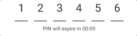

# rn-pin-input
A React Native pin-input component with time count down. This component will always show empty six pin-input field to be filled later by user.




## Installation

```
    npm i @miidx/rn-pin-input
```


## Usage

```jsx
    <PinInput
        value="123456"
        onTextChanged={text => { console.log(text); }}
        pinExpirationDate="2019-12-19T17:32+07:00"
        onPinExpired={() => { console.log('Time is up!'); }}
        countdownLabel={'PIN will expire in'}
    />
```

## Properties

 Name           | Description                                 | Type     | Required  | Default value   
:---------------|:------------------------------------------- |:---------|:---------:|:--------------
 containerStyle        | Style of text input field container                    | object   | no       | `{}`          
 contentContainerStyle       | Style of each pin-input container                 | object  | no          | `{}`          
 countdownLabel       | Text shown beside time count down                 | string  | no          | `''`          
 expiringLabel       | Text shown after reach end time of count down                 | string  | no          | `'Pin has expired'`          
 onPinExpired        | Callback called when pin has expired      | function | yes       |           
 onTextChanged           | Callback when text on pin-input field changed                          | function  | yes          |           
 pinExpirationDate         | Expiring pin time value in complete ISO-8601 date time format `YYYY-MM-DDTHH:mmZ`. `YYYY` is 4 digit year, `MM` is month number, `DD` is day of month, `HH` is hours in 24 hour time, `mm` is minutes, and `Z` is offset from UTC time, such as `+-HH:mm`. Adding seconds `s` and fractional seconds `SS` are optional                        | string  | yes          |           
 textStyle          | Style of pin text inside component                  | object   | no          | `{}`          
 value  | Complete number value of pin input    | string   | yes          |        


```


```


### Note:
* This package use `rn-count-down` component for its count down timer to read the documentation, [click here](https://github.com/miidx/rn-count-down "rn-count-down").